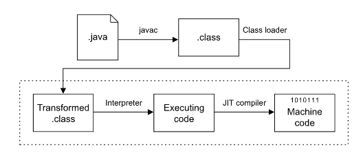

# Chapter 1

## 1.1 언어와 플랫폼
- 객체지향 언어인 자바
- 클래스 파일 형태로 제공된 코드를 링크하고 실행하는 JVM
- 자바 플랫폼에서 클래스 파일형태로 제공된 코드를 읽기 위해서는 자바 파일을 클래스 파일로 컴파일해야한다.
- 
- 자바 소스코드는 .class 파일로 변환된 다음, 로드 시 조작된 후 JIT 컴파일된다.
- JIT 컴파일러가 한번 번역한 코드는 저장소에 저장되어 다음번에 같은 코드가 실행될 때 재사용된다.
  - JIT의 개념: https://catch-me-java.tistory.com/11
- 자바는 컴파일 언어이자 인터프리터 언어이다.

## 1.2 새로운 자바 릴리스 모델
- 자바의 새로운 버전은 6개월마다 릴리스된다.
- 장기 지원 버전 격차를 3년에서 2년으로 줄이기위한 논의가 진행중이다.
- 배포에 대한 라이선스 제한으로 인해 대안을 고려해볼만하다.
- Eclipse Adoptium, 알리바바, 아마존, Zulu, IBM, 마이크로소프트, 레드햇, SAP가 있다.

## 1.3 향상된 타입 추론(var 키워드)
- 자바 개발자들이 자바의 거의 첫번째 릴리스부터 요구해온 타이핑의 양을 줄일 수 있는 방법이다.
- 좌측항과 동일한 제네릭 타입을 제거하면 <> 이렇게 다이아몬드만 남는데 이를 다이아몬드 구문이라고 한다.
- var의 경우 타입 추론은 로컬 변수의 선언만을 검사한다.
- 필드, 메서드 인수, 반환 타입에는 사용할 수 없으며, 컴파일러에서만 구현되기 때문에 런타임이나 성능에는 전혀 영향을 미치지 않는다.
- var 타입을 추론 할 수 없는 경우에는 사용하지 못한다. ex) null
- 간단한 사용 지침
  - 단순한 초기화에서, 오른쪽이 생성자 또는 정적 팩토리 메서드에 대한 호출인 경우
  - 명시적인 타입을 제거하면 반복되거나 중복된 정보가 삭제되는 경우
  - 변수 일므만으로도 타입을 알 수 있는 경우
  - 로컬 변수의 범위와 사용법이 짧고 간단한 경우

## 1.4 언어 및 플랫폼 변경
- 단순한 형태의 독립적인 기능을 시험해보기 위해 인큐베이팅 기능을 사용해볼 수 있다.
  - jdk.incubator.http -> java.net.http
- 미완성 기능을 배포하는 프리뷰 기능도 있다.
  - 프리뷰 기능을 사용하기 위해서는 특정 플래그가 전달되어야 한다.
  - 프로덕션용으로는 사용할 수 없다.

## 1.5 자바 11에서의 작은 변경 사항
### 컬렉션 팩토리
  - List.of(), Set.of(), Map.ofEntries() 메서드 추가
  - 불변 타입의 인스턴스를 생성한다.
  - 수정을 시도하면 예외가 발생한다.
### 엔터프라이즈 모듈 제거
  - 자바 SE에 자바 EE의 몇몇 모듈이 추가됨.
  - JAXB
  - JAX-WS
  - COBRA
  - JTA
  - (11장에서 자세히 살펴 볼 예정)
### HTTP/2
- 기존 HTTP 1.1 의 문제점을 개선
  - 헤드 오브 라인 블로킹
    - 같은 연결에서 한 번에 하나의 응답만을 처리하는 방법
    - HTTP/2에서는 다중 스트림을 지원하여 작은 응답이 더 정확하게 캐시될 수 있다.
  - 단일 사이트로의 제한된 연결
    - 기존에는 서버에 대한 연결을 한번에 두 개로 제한할 것을 권장함.
    - HTTP/2는 원하는 만큼의 동시 요청을 수행할 수 있다.
  - HTTP 제어 헤더의 성능 오버헤드
    - HTTP 1.1의 페이로드는 압축이 가능하지만 헤더는 압축되지 않는다.
    - HTTP/2는 헤더 압축을 지원하여 오버헤드를 줄인다. (헤더의 새로운 이진 형식을 통해 문제 해결)
### 단일 소스 코드 프로그램(JEP 330)
- 소스 코드가 메모리에서 컴파일된 다음, 디스크에 .class 파일을 생성하지 않고 인터프리터로 실행할 수 있다.
- 제약 사항
  - 단일 소스 파일에 있는 코드로 제한된다.
  - 동일한 실행에서 추가적인 소스 파일을 컴파일 할 수 없다.
  - 소스 파일에 여러 클래스를 포함할 수 있다.
  - 소스 파일에서 첫 번째 클래스를 진입점으로 선언해야한다.
  - 진입점 클래스에서 main 메서드를 정의해야 한다.
  - #!/usr/bin/java --source 11 과 같은 셔뱅 라인을 포함할 수도 있다.