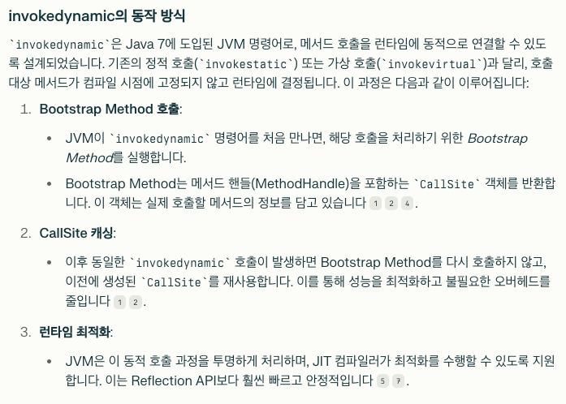
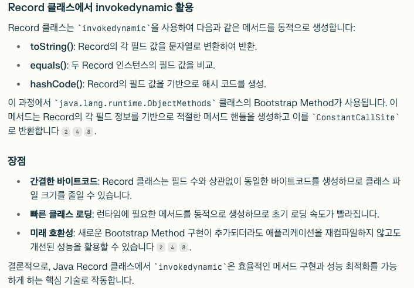

# Chapter 3 자바 17

## 3.1 Text 블록
```java
String query """
    SELECT `EMP_ID`, `LAST_NAME` FROM `EMPLOYEE_TB`
    WHERE `CITY` = 'INDIANAPOLIS'
    ORDER BY `EMP_ID`, `LAST_NAME`;
"""
```

String query """
SELECT `EMP_ID`, `LAST_NAME` FROM `EMPLOYEE_TB`
WHERE `CITY` = 'INDIANAPOLIS'
ORDER BY `EMP_ID`, `LAST_NAME`;

- 줄 종결 문자는 LF(\u000A) 유닉스 줄 종료 규칙으로 변환된다.
- 예제처럼 자바 소스 코드의 추가 들여쓰기를 허용하기 위해 블록을 둘러싼 여분의 공백이 제거된다.
- 블록의 모든 이스케이프 시퀀스가 해석된다.

## 3.2 switch 표현식
- 기존의 switch문 에서의 단점을 해결하고자 switch 표현식이 추가되었다.
```java
String result = switch (day) {
    case MONDAY, FRIDAY, SUNDAY -> "It's a day off.";
    case TUESDAY                -> "It's a work day.";
    case THURSDAY               -> "Almost there.";
    case WEDNESDAY              -> "Midweek.";
    case SATURDAY, SUNDAY        -> "Weekend.";
    default                     -> "Invalid day.";
};
```
- java 14에서는 yield 키워드를 사용했지만, java 17에서는 화살표(->)를 사용한다.
- switch 표현식은 switch문과 달리 break문이 필요없다.
- switch 표현식은 값을 반환할 수 있으며, 반환값의 타입은 switch 표현식의 타입과 일치해야 한다.

## 3.3 record
- 데이터 전용 집계 모델링을 위한 최고 수준의 수단 제공
- 자바의 타입 시스템에서 발생할 수 있는 격차 해소
- 공통 프로그래밍 패턴을 위한 언어 수준 문법 제공
- 클래스 상용구 감소
- 레코드 컴포넌트라고 하는 일련의 고저오딘 값들을 위한 불변이면서 투명한 캐리어다.
- 각 컴포넌트는 제공된 값을 보유하는 final 필드와 값을 검색하는 접근자 메서드를 생성한다.
```java
public record Point(int x, int y) { }
```
- toString(), equals(), hashCode() 메서드를 자동으로 생성한다.
- 위 세 메서드는 invokedynamic 기반의 메커니즘을 통해 생성되어, 런타임에 최적화된다.
- 참고링크: https://blog.hexabrain.net/400
- 
- 

## 3.3.1 명목적 타이핑
- 명목적 타이핑은 레코드의 이름이 레코드의 의미를 나타낸다.
- 기본 데이터 캐리어에 많은 추가 메서드 등을 추가하고 싶거나 여러 인터페이스를 구현하고 싶을수록 레코드가 아닌 일반 클래스를 사용해야 할 가능성이 높다.

## 3.3.2 콤팩트 레코드 생성자
- 레코드 클래스의 콤팩트 생성자의 형식 매개변수는 암묵적으로 선언된다.
- 이들은 레코드 클래스의 파생된 형식 매개변수 목록으로부터 제공된다.
- 콤팩트 생성자는 인수로 전달된 값을 검증하고 정규화하는 역할을 수행하며,
- 나머지 초기화 코드는 컴파일러가 자동으로 처리한다.
```java
public record Point(int x, int y) {
    public Point {
        if (x < 0 || y < 0) {
            throw new IllegalArgumentException();
        }
    }
}
```
- 위와 같이 생성자를 정의하면, 생성자를 호출할 때 x, y 값이 음수인지 검사하고, 음수일 경우 IllegalArgumentException을 발생시킨다.

## 3.4 sealed 타입
- sealed 클래스는 자신을 확장할 수 있는 클래스를 제한한다.
```java
public sealed class Shape permits Circle, Rectangle, Square { }
```
- permits 키워드를 사용하여 허용된 서브클래스를 나열한다. (동일한 파일 내에 있을 필요가 없다.)
- 이러한 타입으로 프로그래밍하면 Shape의 발생 가능한 인스턴스는 Circle, Rectangle, Square의 인스턴스만 가능하다.
- 컴파일러도 이 정보를 활용해 안전하게 가정이 가능하고, 사용하는 클라이언트는 이 가정을 위반할 수 없다.

sealed 타입은 다음과 같다.
- 최종 클래스와 공개 클래스 사이의 중간 지점으로 생각할 수도 있다.
- 인스턴스 대신 타입에 적용된 열거형 패턴으로 생각할 수도 있다.

## 3.5 instanceof의 새로운 형식
- instanceof 연산자는 이제 패턴 매칭을 지원한다.
```java
if (obj instanceof String s) {
    System.out.println(s.length());
} else {
    System.out.println("Not a string");
}
```

## 3.6 패턴 매칭과 프리뷰 기능
```java
var msg = switch (obj) {
    case Integer i -> "It's an integer." + i;
    case String s  -> "It's a string." + s;
    case Long l    -> "It's a long." + l;
    case null      -> "It's null.";
    default        -> "It's something else.";
};
```

- --enable-preivew 옵션을 사용하여 프리뷰 기능을 사용할 수 있다.

```java
public sealed interface FXOrderResponse permits FXAccepted, FXFill, FXReject, FXCancelled {
    LocalDateTime timestamp();
    long orderId();
}

var msg = switch (resp) {
    case FXAccepted a -> a.orderId() + " Accepted";
    case FXFill f && f.units() < 100 -> f.orderId() + "Small Fill";
    case FXFill f      -> f.orderId() + "Filled " + f.units();
    case FXReject r    -> r.orderId() + "Rejected " + r.reason();
    case FXCancelled c -> c.orderId() + "Cancelled ";
    case null          -> "Order is null";
};

System.out.println(msg);
```

- null safe 한 코드
- FXOrderResponse의 허용된 모든 하위 타입을 검사할 수 있다.