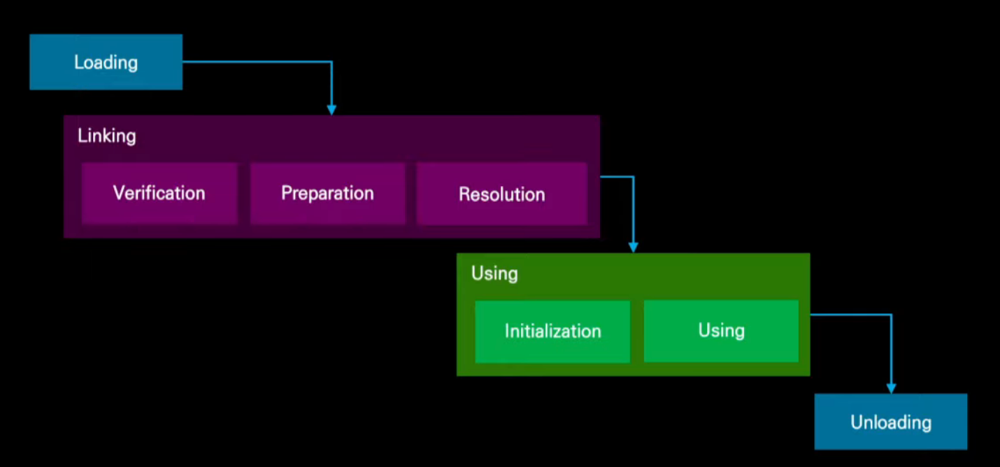

# Chapter 04 클래스 파일과 바이트 코드
## 4.1 클래스 로딩과 클래스 객체

- 클래스 로딩 및 링킹 과정 : JVM이 Java 코드를 실행할 때, 작성한 클래스 파일을 메모리 올리고 사용할 수 있도록 준비하는 과정
	- 클래스 로딩 및 링킹 과정 모두 런타임에 이루어짐
	- 성능이 일부 저하할 수 있으나 확장성과 유연성을 제공함
  		- 인터페이스만 맞으면 Runtime에 구현 클래스를 결정하지 않을 수 있음
	- Resoultion 단계는 동적 바인딩을 지원할 목적으로 초기화 후로 지연될 수 있음

### 4.1.1 로딩과 링킹
- 로딩: 클래스 파일을 읽어 JVM 메모리에 올리는 과정 (클래스 내용을 읽고, 올바른 구조인지 확인)
- 링킹: 로딩된 클래스 파일이 검증, 준비, 해석 단계를 거쳐 메모리에 적재함으로써 실제 사용할 수 있도록 준비하는 과정

- JVM을 바라보는 한 가지 방법
  - JVM은 실행 컨테이너임
  - JVM은 클래스 파일의 내용을 바이트 데이터 스트림으로 조회해 사용 가능한 형태로 변환 후 실행 상태에 추가함
    - 로딩(loading) & 링킹(Linking)으로 나눌 수 있음

#### 로딩 프로세스
- 클래스 파일을 구성하는 바이트의 데이터 스트림 가져옴
- 스트림 파싱 후 유효한 클래스 파일 구조를 포함하고 있는지 확인함(형식 검사)
  - 기본적인 검사 수행 
    - "로드 중인 클래스가 실제로 선언된 슈퍼클래스에 액세스할 수 있는가?"
    - "final 메서드를 재정의하려고 시도하는가?"
- 로딩 프로세스가 끝나고 클래스에 해당하는 데이터 구조는 아직 다른 코드에서 사용할 수 없고, 완전히 기능이 구현된 class가 아님

#### 링킹 프로세스
- 검증
  - JVM 명세가 정하는 규칙을 만족하는지 확인
    - 파일형식 (.class)
    - 메타데이터
    - 바이트코드
        - 바이트코드가 허용되지 않거나 악의적인 방법으로 스택을 조작하려고 시도하지 않는지 확인
        - 모든 분기 명령어에 적절한 대상 명령어가 있는지 확인
        - 메서드가 올바른 정적 유형의 매개변수 수로 호출되는지 확인
        - 로컬 변수에 적절한 타입의 값만 할당됐는지 확인
        - 던질 수 있는 각 예외에 적절한 캐치 핸들러가 있는지 확인
        - 이러한 검사를 통해 런타임 검사를 건너뛸 수 있으므로 해석한 코드가 더 빠르게 실행될 수 있음
    - 심벌 참조
    - 보안 위협에 대한 검증도 포함
      - 바이트 코드 검증시 함께 확인 (바이트코드가 허용되지 않거나 악의적인 방법으로 스택을 조작하려고 시도하지 않는지 확인)
      - C나 C++ 비해 안정적

- 준비
  - 클래스가 사용할 메모리를 할당해 (객체 인스턴스가 저장될 메모리 공간을 확보)
  - 필드에 기본값 설정 (필드값 변경은 생성자 실행할 때 변경됨)
  - 아직 생성자 실행되지 않음

- 해결
  - 해당 클래스가 사용하려는 다른 클래스, 메서드, 필드를 찾아 연결함
    - 예를 들어 String 타입을 사용했다면, JVM이 String 클래스를 찾아서 같이 로딩함
  - 링킹할 클래스의 상위 유형이 이미 링킹됐는지 확인하고, 그렇지 않은 경우 이 클래스의 링크가 계속되기 전에 해당 타입들을 링킹함
  - 이로 인해 이전에 볼 수 없었던 새로운 타입에 대한 재귀적인 링크 프로세스가 발생할 수 있음
  - 로드해야 하는 모든 추가적인 타입을 찾아서 해결하면 JVM은 원래 로드하도록 요청받은 클래스를 초기화

- 초기화
  - 모든 정적 변수가 초기화되고 모든 정적 초기화 블록이 실행됨
  - **이제 JVM이 새로 로드된 클래스의 바이트코드를 실행을 시작**
  - **이제 JVM이 이 클래스를 사용할 수 있는 상태**

### 4.1.2 Class 객체
- Class 객체는 클래스가 로딩되고 링킹이 끝나면, JVM가 이를 표현하는 Class 객체를 만듦
- 이 객체를 통해 클래스 정보를 알 수 있음
   - 예를 들어, getSuperclass()를 사용하면 부모 클래스가 무엇인지 알 수 있음
   - 리플랙션 API를 사용해서 클래스의 메서드, 필드, 생성자 등도 가져올 수 있음

### 정리 : 클래스 로딩의 흐름 및 클래스 객체
클래스 로딩 → 링킹 → 초기화 단계를 거쳐 JVM이 클래스를 실행할 준비를 함

1. 클래스 파일 읽기
2. 클래스 파일을 JVM 메모리에 적재 (로딩)
3. 로딩된 클래스 파일 규칙 검증 & 메모리 할당 (링킹)
4. 정적 변수 초기화 및 정적 초기화 블록 실행 (초기화)
5. 실행 가능

클래스 객체는 JVM이 클래스 정보를 담아둔 객체 (리플렉션 등에 사용)

<br>

## 4.2 클래스 로더
- 클래스로더 : 자바에서 클래스를 JVM 메모리에 올리는 역할을 하는 특수한 객체
  - ClassLoader를 확장하는 자바의 클래스
  - 그 자체로 자바의 타입
  - 클래스 파일의 저수준 구문 분석을 담당하는 로드와 링크 부분을 포함해 몇 가지 네이티브 메서드가 있음(사용자 클래스로더는 해당 부분을 재정의 불가)
  - 네이티브 코드를 사용해 클래스로더를 작성할 수 없음
  - 클래스로더는 핵심 역할 외에도 JAR 파일이나 클래스패스의 다른 위치에서 리소스를 로드하는 데 사용하는 경우가 많음

- BootstrapClassLoader
  - 가장 처음 동작하는 클래스 로더
  - JVM을 시작하는 프로세스 초기에 인스턴스화되므로 일반적으로 JVM 자체의 일부라고 생각하는 것이 가장 좋음
  - java.base(ex. `java.lang.String` 같은 기본클래스들)를 로드하는데 사용
- PlatformClassLoader
  - JVM이 어느 정도 부팅된 후 플랫폼 관련 클래스들을 로드하는 역할
      - ex. `java.sql` 같은 표준 라이브러리 모듈을 불러올 때 사용됨

- AppClassLoader
  - 애플리케이션의 클래스들을 로드하는 주된 클래스 로더
  - 가장 널리 사용되는 클래스로더
  - classpath(즉, 작성한 코드와 라이브러리들)를 스캔해서 클래스를 찾음

### 4.2.1 사용자 정의 클래스 로드
기본 클래스로더만으로 충분할 때도 있지만, 가끔 특정 방식으로 클래스를 로드해야 할 때가 있음
  - 네트워크에서 클래스를 다운로드해서 로드할 때
  - 클래스를 동적으로 변형해서 실행할 때 (예: 바이트코드 수정)

이럴 때 사용자 정의 클래스로더를 만들 수 있음

- 사용자 정의 클래스 로더도 하나의 자바 타입이므로 일반적으로 상위 클래스로더(parent class loader)라고 하는 클래스로더에서 로드해야함
```Java
protected Class<?> loadClass(String name, boolean resolve) 
	throws ClassNotFoundException {
	synchronized(getClassLoadingLock(name)){
		// 먼저 클래스가 이미 로드됐는지 확인
		Class<?> c = findLoadedClass(name);
			if(c == null){
				//...
				try {
					if(parent != null){
						c = parent.loadClass(name, false);
					}else{
						c = findBoostrapClassOrNull(name);
					}
				} catch(ClassNotFoundException e){
					// 널이 아닌 부모 클래스로더에서 클래스를 찾을 수 없는 경우
					// ClassNotFoundException가 발생
				}
			}
	
			if(c == null){
				// 그래도 클래스를 찾을 수 없는 경우
				// findClass를 호출해 클래스를 찾는다
				c = findClass(name);
				//...
			}
		}
		return c;
	}
}
```

#### 클래스 로드 중 발생할 수 있는 예외들
- NoClassDefFoundError
  - 요청된 클래스의 존재를 알고 있지만, 내부 메타데이터에서 해당 클래스에 대한 정의를 찾지 못했다는 의미
  - ex. A.class가 B.class를 필요로 하지만, 실행할 때 B.class가 없으면 발생
  - JVM은 클래스 로드 시도에 실패할 경우 negative caching을 효과적으로 구현해서 로드를 다시 시도하지 않고 대신 NoClassDefFoundError를 발생시킴
- UnsupportedClassVersionError
  - 클래스가 현재 실행 중인 JVM보다 더 높은 버전에서 컴파일되었을 때 발생하는 에러
  - ex. Java 21에서 컴파일한 클래스를 Java 17에서 실행하려고 하면 오류 발생

#### 첫 번째 사용자 정의 클래스로더
  - ClassLoader의 defineClass()
    - 바이트 배열을 받아 클래스 객체로 변환
    - protected, final 메서드
    - java.lang.ClassLoader에 정의 되어 있어, ClassLoader의 서브클래스만 액세스할 수 있음 <br>→ 사용자 정의 클래스로더로는 defineClass()의 기본 기능에 액세스할 수 있지만, 검증 또는 기타 저수준 클래스 로딩 로직을 변경할 수 없음
    - 핫스폰 가상 머신의 경우 defineClass()는 네이티브 메서드 defineClass1()에 위임해 몇 가지 기본 검사를 수행하고 JVM_DefineClassWithSource()라는 C 함수 호출
  - MethodOops
    - 클래스 로딩 완료 후 메서드의 바이트코드가 메서드를 나타내는 핫스폿의 메타데이터 객체에 배치 시 이 메타데이터 객체를 methodOops라고 함 
    - 예시: DI 프레임워크
      - DI와 관련성이 높은 두 가지 주요 개념
        - 시스템 내의 기능 단위에는 적절한 기능을 수행하기 위해 의존하는 의존성과 구성 정보가 있음
        - methodOops
          - 클래스 로딩 완료 후 메서드의 바이트코드가 메서드를 나타내는 핫스폿의 메타데이터 객체에 배치 시 이 메타데이터 객체를 methodOops라고 함
  - 가장 간단한 형태의 사용자 정의 클래스 로딩은 **ClassLoader를 서브클래싱하고 findClass()를 override하는 것**
  - 예시
    ```Java
    public class LoadSomeClasses {
        public static class SadClassLoader extends ClassLoader {
            super(SadClassLoader.class.getClassLoader());
        }
    
        public Class<?> findClass(String name) throws
            ClassNotFoundException {
            System.out.println("I am very concerned..")	;
            throw new ClassNotFoundException(name);
        }
    
        public static void main(String[] args){
            if(args.length > 0){
                var loader = new SadClassLoader();
                for (var name : args){
                    System.out.println(name+ " :: ");
                    try {
                        var clazz = loader.loadClass(name);
                        System.out.println(clazz);
                    } catch(ClassNotFoundException e){
                        x.printStackTrace();
                    }
                }
            }
        }
    }
    ```

#### 클래스 로딩의 진행
  - 첫 번째 단계는 DIMain 클래스와 이 클래스가 참조하는 모든 프레임워크 클래스를 로드
  - 다음은 DIMain이 실행을 시작하고, 구성 파일의 위치를  main()의 매개변수로 받음
  - 이 과정이 올바르게 완료되면 애플리케이션 콘텍스트가 설정되고 실행을 시작할 수 있게 됨

#### 예시: 인스트루먼테이션 클래스로더
  - 클래스가 로드될 때 바이트코드를 변경해서 추가적인 인스트루먼테이션 정보를 추가하는 클래스 로더
  - 변환된 코드에 대해 테스트 케이스가 실행되면 인스트루먼테이션 코드는 테스트 케이스가 실제로 테스트하는 메서드와 코드 분기를 기록

### 4.2.2 모듈 및 클래스 로딩
- Java 9부터는 모듈 시스템이 추가되면서 클래스 로딩이 좀 더 정교해짐
  - 기존에는 classpath를 기반으로 클래스를 찾았는데, 이제는 모듈 그래프를 계산해서 로드해야 했음
  - 즉, 필요한 모듈만 로드하고 불필요한 모듈은 제외하는 방식임

- 모듈 해결(module resolution)
  - 모듈형 JVM에서  프로그램 실행 시 런타임이 모듈 그래프를 계산하고 첫 번째 단계를 만족시키는 것
    - 첫 번째 단계 
      - 루트 모듈 식별 및 가시성 확인 
      - 애플리케이션의 메인 모듈(루트 모듈) 식별 
      - 루트 모듈이 필요로 하는 다른 모듈 확인 
      - 이 모듈들이 루트 모듈에서 접근 가능한지 확인

### 정리 : 클래스 로더 및 클래스 로드 예외
- 클래스로더는 자바 클래스(.class 파일)를 찾아서 JVM에 로드하는 역할을 하는데 부트스트랩, 플랫폼, 애플리케이션 클래스로더 3가지 기본 클래스로더가 있음
- 사용자 정의 클래스로더를 만들어 특정 방식으로 클래스를 로드할 수 있음
- 클래스 로딩 중 NoClassDefFoundError, UnsupportedClassVersionError 같은 오류가 발생할 수 있음
- Java 9부터는 모듈 시스템이 도입되어 필요한 모듈만 로드하는 방식으로 발전했음

<br>

## 4.3 클래스 파일 살펴보기
### 4.3.1 javap 소개
javap는 컴파일된 .class 파일을 분석하는 명령어<br>
작성한 자바 코드를 컴파일한 후, 바이트코드(기계가 읽을 수 있는 코드)로 변환된 내용을 확인

- 사용 방법
  ```Java
  $ javap LoadSomeClasses.class
  ```

### 4.3.2 메서드 시그니처를 위한 내부 형식
자바의 메서드는 입력값(파라미터)과 반환값(리턴 타입)으로 이루어진 시그니처(signature)를 가지고 있음<br>
이걸 .class 파일에서 표현할 때는 "타입 기술자(type descriptor)" 라는 걸 사용

- 메서드 시그니처(method signature)
  - 메서드 시그니처의 각 타입은 타입 기술자로 표현
- 타입 기술자(type descriptor)
  - 압축 형식으로 타입 이름이 압축

| 설명자           | 타입       |
| ------------- | -------- |
| B             | Byte     |
| C             | Char     |
| D             | Double   |
| F             | Float    |
| I             | Int      |
| J             | Long     |
| L\<type name> | 참조 타입    |
| S             | Short    |
| V             | Void     |
| Z             | Boolean  |
| [             | Array-of |

- javap + 타입 기술자를 확인할 수 있는 방법
  ```Java 
  $javap -s LoadSomeClasses.class
  ```

### 4.3.3 상수 풀
- 상수 풀(constant pool)
  - 클래스 파일 내부에는 상수 풀(Constant Pool)이라는 영역 있음
  - 클래스 파일의 다른 상수(ex. 변수, 문자열, 숫자, 메서드, 필드 등) 요소에서 편리한 바로 가기를 제공하는 영역 

- 상수 풀 항목

| 이름                 | 설명                                                  |
| ------------------ |-----------------------------------------------------|
| Class              | 클래스 상수다. 클래스 이름을 가리킨다.(utf 항목으로)                    |
| Fieldref           | 필드를 정의한다. 이 필드의 클래스와 NameAndType을 가리킨다.             |
| Methodref          | 메서드를 정의한다. 이 필드의 클래스와 NameAndType을 가리킨다.            |
| InterfaceMethodref | 인터페이스 메서드를 정의한다.  이 필드의 클래스와 NameAndType을 가리킨다.     |
| String             | 문자열 상수다. 문자를 저장하는 utf8 항목을 가리킨다.                    |
| Integer            | 정수 상수(4바이트)                                         |
| Float              | 부동 소수점 상수(4바이트)                                     |
| Long               | 긴 상수(8바이트)                                          |
| Double             | 배정밀도 부동 소수점 상수(4바이트)                                |
| NameAndType        | 이름과 유형 쌍을 설명한다. 유형은 해당 유형의 유형 설명자를 포함하는 utf8을 가리킨다. |
| Utf8               | utf8로 인코딩된 문자를 나타내는 바이트 스트림                         |
| InvokeDynamic      | invokedynamic 메커니즘의 일부                              |
| MethodHandle       | invokedynamic 메커니즘의 일부                              |
| MethodType         | invokedynamic 메커니즘의 일부                              |

- playpen 샘플 클래스
  ```Java
  public class ScratchImpl {
      private static ScratchImpl inst = null;
  
      private ScratchImpl(){
      
      };
      private void run(){};
      public static void main(String[] args){
          inst = new ScratchImpl();
          inst.run();
      }
  }
  // 이 코드를 .class 파일로 변환하면, 상수 풀에 저장될 항목들이 생김
  // 저장되는 것들
  // 1. 클래스 이름 (ScratchImpl) → Class 항목
  // 2. 메서드 이름 (run, main) → Methodref 항목
  // 3. 문자열 (없음, 하지만 있으면 String 항목에 저장)
  // 4. 변수 (inst) → Fieldref 항목
  ```

### 정리 : .class 파일이 내부적으로 어떻게 저장되는지
- javap 명령어를 사용하면 .class 파일을 분석할 수 있음
- 메서드 시그니처(타입 기술자)는 (입력 타입)반환 타입 형식으로 저장됨
- 상수 풀(Constant Pool)은 자주 쓰이는 값(클래스, 메서드, 필드, 문자열 등)을 저장하는 공간임

<br>

## 4.4 바이트코드
- 바이트코드
  - 사람이 읽을 수 있는 소스 코드와 컴퓨터가 실행하는 기계 코드의 중간에 있는 프로그램의 중간 표현
  - 자바 소스 코드 파일에서 javac에 의해 생성
  - 자바의 for, while 같은 제어문이 사라지고 분기 명령어로 바뀜
  - 각 오퍼레이션 코드는 단일 바이트(1바이트)로 표현
  - JIT(Just-In-Time) 컴파일러가 실행하면서 기계어 코드로 바꿔 더 빠르게 실행될 수 있음

### 4.4.1 클래스 분해하기
- 클래스 분해 방법
  ```bash
  $ javap -c -p ScratchImpl.class
  ```
- 정적 블록
  - 클래스가 처음 로드될 때 실행되는 코드 블록
  - 변수 초기화가 이루어지는 곳
  - 인스턴스를 null로 초기화
  - 예시
  ```Shell
  static {};
  
  Code:
      0: aconst_null // null 값을 로드
      1: putstatic #10 // inst 변수를 null로 설정
      4: return
  ```
- 생성자
  - 자바에서는 모든 클래스가 Object 클래스를 상속하므로, 생성자가 실행될 때 항상 super() 호출이 포함됨
  ```Shell
  private ScratchImpl();
  
  Code:
      0: aload_0 // this를 로드
      1: invokespecial #15  // 부모 클래스(Object) 생성자 호출
      4: return
  ```
  - aload_0
      - 참조(주소)를 로드하고, 0번째 로컬 변수를 로드하기 위한 단축 형태를 사용
      - 0번 로컬 변수는 현재 객체인 this
  - new 오퍼레이션 코드
      - 새 인스턴스를 위한 메모리를 할당하고, 그 참조를 스택의 맨 위로 놓음
  - dup 오퍼레이션 코드
      - 스택의 맨 위에 있는 참조를 복제
  - 메서드 호출 시 수신자 객체에 대한 참조와 메서드에 대한 인수들이 스택에서 소비 → 이를 위해 dup를 먼저 수행

### 4.4.2 런타임 환경
- **평가스택(evaluation stack)** & **피연산자 스택(operand stack)**
	- JVM이 하드웨어 CPU의 프로세서 레지스터 대신 계산과 연산에 사용하는 스택
	- 메서드 내에서 지역적으로 사용
	- 메서드 호출 시마다 새로운 평가 스택이 생성
	- JVM은 각 자바 스레드마다 call stack(호출 스택)을 가지고 있고, 어떤 메서드가 실행됐는지 기록
	- 수치 계산에 대한 스택 사용
	- 클래스 로딩 검증 단계에서 새로 로드된 클래스의 메서드가 스택을 남용하지 않는지 확인하기 위해 검사를 수행 <br>→ 이를 통해 잘못된 혹은 고의, 악의적인 클래스가 시스템에 허용돼 문제를 일으키는 것을 방지
	- 호출 스택과 평가 스택의 상호 작용
  ```Java
  var numPets = 3 + petRecords.getNumberOfPets("Ben")	;
  ```
	- 피연산자 스택에 3을 넣음
	- 메서드 호출을 통해 Ben이 보유한 반려동물 수 계산
	- 수신자 객체(여기서는 petRecords)를 평가스택으로 푸시하고 호출 인수 넣음
	- invoke 오퍼레이션 코드 중 하나를 사용해 getNumberOfPets() 메서드 호출
	- 호출된 메서드가 제어권을 가지고 방금 입력한 메서드가 호출 스택으로 나타남
		- JVM이 새 메서드로 진입하면 새로운 피연산자 스택을 사용하므로, 호출자의 피연산자 스택에 이미 있는 값은 호출된 메서드에서 계산된 결과에 영향을 줄 수 없음
	- getNumberOfPets()가 완료되면 반환값이 호출자의 피연산자 스택에 놓임 => getNumberOfPets를 호출 스택에서 제거하는 과정
	- 덧셈 연산 수행

### 4.4.3 오퍼레이션 코드 소개
> JVM은 순수한 객체지향 런타임 환경이 아니다.<br>
> JVM은 원시 타입에 대한 지식을 갖고 있다. 이는 일부 오퍼레이션 코드 패밀리에서 나타난다.<br> 
> 일부 기본 오퍼레이션 코드 유형(store, add)은 작동하는 원시 타입에 따라 다른 여러 변형을 가져야 한다

#### 오퍼레이션 코드
  - JVM 바이트코드는 **operation code의 연속**
  - 오퍼레이션 코드는 주어진 상태에서 스택을 찾고, 인수들을 제거하고 그 자리에 결과를 놓는 방식으로 스택을 변형
  - 단일 바이트값으로 표시되어 최대 255개의 가능한 오퍼레이션 코드가 존재(현재는 200개만 사용)
  - 대부분의 오퍼레이션 코드는 유사한 기능을 제공하는 여러 기본 패밀리 중 하나

#### 오퍼레이션 코드 표의 네 가지 열
- Name
    - 오퍼레이션 코드 타입에 대한 일반적인 이름
    - 여러 관련 오퍼레이션 코드가 유사한 작업 수행
- Args
  - 오퍼레이션 코드가 사용하는 인수들
  - i로 시작하는 인수는 상수 풀이나 로컬 변수표에서 조회 인덱스를 구성하는데 사용하는 바이트
  - 인수(arg)가 대괄호 안에 표시된 경우 해당 오퍼레이션 코드의 모든 형태(변형)가 그 인수를 사용하지 않을 수도 있다는 의미
- stack layout
  - 오퍼레이션 코드가 실행되기 전과 후의 스택 상태롤 보여줌
  - 대괄호 안의 요소는 오퍼레이션 코드의 모든 형태가 해당 요소를 사용하지 않거나 해당 요소가 선택 사항임을 나타냄
- Description
  - 오퍼레이션 코드가 하는 일을 설명

#### 오퍼레이션 코드 예시
- getfield : 오퍼레이션 코드 이름 (스택에서 객체를 꺼내 해당 객체의 필드를 읽는 명령어)
- i1, i2 : 오퍼레이션 코드 뒤에 바이트 스트림에서 따라오는 두 개의 인수가 있음

|이름|인수|스택 변화| 설명|
| --------- | ----- | ------------------- | --------------------------------------|
| getfield | i1, i2 | [obj] -> [val] | 스택 상단에 있는 객체로부터 지정된 상수 풀 인덱스에 있는 필드값을 가져온다 |

### 4.4.4 load 및 store 오퍼레이션 코드
자바 프로그램에서 변수 값을 저장하고 불러오는 과정은 바이트코드에서 load와 store 명령어로 표현됨

- 로드와 저장 오퍼레이션 코드

| 이름        | 인수    | 스택 레이아웃             | 설명                                                |
| --------- | ----- | ------------------- | ---------------------------------------------------------------- |
| load      | (i1)  | [] -> [val]         | 로컬 변수에서 스택으로 값(원시 또는 참조)을 로드한다. 바로 가기 형식과 타입별 변형이 있다             |
| ldc       | i1    | [] -> [val]         | 풀에서 스택으로 상수를 로드한다. 타입별과 광범위한 변형이 있다                              |
| store     | (i1)  | [val] -> []         | 값(원시 또는 참조)을 로컬 변수에 저장하고 프로세스 중에 스택에서 제거한다. 바로 가기 형식과 유형별 변형이 있다 |
| dup       |       | [val] -> [val, val] | 스택 상단의 값을 복제한다. 변형 형식이 있다                                        |
| getfield  | i1,i2 | [obj] -> [val]      | 스택 상단의 객체에서 지정된 상수 풀 인덱스에 있는 필드값을 가져온다                           |
| putfield  | i1,i2 | [obj, val] -> []    | 값을 지정된 상수 풀 인덱스에 해당하는 객체의 필드에 넣는다                                |
| getstatic | i1,i2 | [] -> [val]         | 지정된 상수 풀 인덱스에 있는 정적 필드의 값을 가져온다                                  |
| putstatic | i1,i2 | [val] -> []         | 값을 지정된 상수 풀 인덱스에 해당하는 정적 필드를 넣는다                                 |

- getter, setter 디컴파일 예시
  ```Java 
  public class Scratch {
      private int i;
      public Scratch(){
          i = 0;
      }
      public int getI(){
          return i;
      }
  
      public void setI(int i){
          this.i = i;
      }
  }
  ```
  ```
  public int getI();
      Code:
          0: aload_0 // this 객체를 로드
          1: getfield #7 // 필드 i 값을 가져옴
          4:ireturn // 값을 반환
  public void setI(int);
      Code:
          0: aload_0
          1: iload_1
          2: putfield #7 // 필드 i:I
          5: return
  ```
- 스택이 임시 변수를 보관하는데 사용되고 힙 저장소로 전달되는 방식 

### 4.4.5 산술을 위한 오퍼레이션 코드
#### 산술 연산자 코드

| 이름   | 인수 | 스택 레이아웃         | 설명                                                                                             |
| ------ | ---- | --------------------- | ------------------------------------------------------------------------------------------------ |
| add    |      | [val1, val2] -> [res] | 스택 상단의 두 값(동일한 원시 타입)을 더하고 결과를 스택에 저장한다. 단축형과 타입별 변형이 있다 |
| sub    |      | [val1, val2] -> [res] | 스택 상단의 두 값(동일한 원시 타입)을 빼고 결과를 스택에 저장한다. 단축형과 타입별 변형이 있다   |
| div    |      | [val1, val2] -> [res] | 스택 상단의 두 값(동일한 원시 타입)을 나누고 결과를 스택에 저장한다. 단축형과 타입별 변형이 있다 |
| mul    |      | [val1, val2] -> [res] | 스택 상단의 두 값(동일한 원시 타입)을 곱하고 결과를 스택에 저장한다. 단축형과 타입별 변형이 있다 |
| (case) |      | [value]->[res]        | 하나의 원시 타입을 다른 타입으로 캐스트한다. 가능한 모든 캐스트에 해당하는 형태가 있다           |

### 4.4.6 실행 흐름을 제어하기 위한 오퍼레이션 코드
#### 실행 제어 오퍼레이션 코드

| 이름         | 인수      | 스택 레이아웃                   | 설명                                                       |
| ------------ | --------- | ------------------------------- | ---------------------------------------------------------- |
| if           | b1, b2    | [val1, val2]->[] or [val1] ->[] | 만약 특정 조건이 일치하면, 지정된 분기 오프셋으로 점프한다 |
| goto         | b1, b2    | [] -> []                        | 조건 없이 분기 오프셋으로 점프한다. 넒은 형태가 있다       |
| tableswitch  | {depends} | [index] -> []                   | switch 구문을 구현하는 데 사용된다                         |
| lookupswitch | {depends} | [key] ->[]                      | switch 구문을 구현하는 데 사용된다                         |
- b1, b2 인수는 이 메서드 내에서 점프한 바이트코드 위치를 구성하는 데 사용
- if 오퍼레이션 코드 패밀리는 다양한 소스 코드 가능성(숫자 비교, 참조 동등성 등)을 처리하기 위해 15개 이상의 명령어가 있음
- goto 명령어의 넓은 형태인 goto_w는 4바이트 인수를 취하고, 64KB보다 큰 오프셋을 구성
  - goto는 자주 필요하지 않음

### 4.4.7 Invoke 오퍼레이션 코드
#### 오퍼레이션 코드

| 이름            | 인수            | 스택 레이아웃           | 설명                                          |
| --------------- | --------------- | ----------------------- | --------------------------------------------- |
| invokestatic    | i1, i2          | [(val1, ...)] ->[]      | 정적 메소드 호출                              |
| invokevirtual   | i1,i2           | [obj,(val1, ...)] -> [] | '일반' 인스턴스 메서드를 호출                 |
| invokeinterface | i1, i2,count, 0 | [obj,(val1, ...)] -> [] | 인터페이스 메서드를 호출                      |
| invokespecial   | i1,i2           | [obj,(val1, ...)] -> [] | 생성자와 같은 '특수한' 인스턴스 메서드를 호출 |
| invokedynamic   | i1,i2,0,0       | [val1, ...] -> []       | 동적 호출                                     |

#### 오퍼레이션 코드 예시
```Java 
long time = System.currentTimeMillis();

HashMap<String, String> hm = new HashMap<>();
hm.put("now", "bar");

Map<String, String> m = hm;
m.put("foo","baz");
```

#### 해당 코드를 바이트 코드로 변환
```Java 
Code:
	0: invokestatic #2 // Method java/lang/System.currentTimeMillis();J
	  // System.currentTimeMillis();가 invokestatic으로 변환
	  // 매개변수가 없어 평가 스택에 아무것도 로드할 것이 없음
	  
	3: lstore_1
	  // 호출 결과를 로컬 변수 l에 저장
	  
	4: new #3 // java/util/HashMap
	7: dup
	8: invokespecial #4 // Method /java/util/HashMap."<init>":()V
	  // HashMap 인스턴스 생성
	
	11: astore_3
	  // 로컬 변수에 복사해 저장
	
	12: aload_3
	13: ldc #5 // String now
	15: ldc #6 // String bar
	  // HashMap 객체와 put() 호출의 인수를 스택으로 넣음
	
	17: invokevirtual #7 // Method java/util/HashMap.put:(
					 //Ljava/lang/Object;Ljava/langObject;)
					 //Ljava/lang/Object;
	  // put() 메서드의 실제 호출
	  // 인스턴스 메서드 호출은 정적 메서드 호출과 다름. 정적 호출은 호출되는 인스턴스가 없음
	
	20: pop
	  
	21: aload_3
	22: astore 4
	24: aload 4
	  // 4에서 생성한 HashMap인스턴스를 로컬 변수 3에 저장 후 다시 스택에 로드
	  // 그 참조의 복사본을 로컬 변수 4에 저장
	  // 이 과정에서 해당 인스턴스가 스택에서 제거되어 사용 전 다시 hashMap을 로드해야함
	  // 원래 자바 코드에서 추가적인 로컬 변수 "Map<String, String> m = hm"에 의해 발생하는데, 이 변수는 항상 원래 이 변수와 동일한 객체를 참조
	 
	26: ldc #8 //String foo
	28: ldc #9 //String baz
	  // 명령어에서 맵에 넣을 값을 로드
	  
	30: invokeinterface #10, 3 // InterfaceMethod java/util/Map.put:(
						   //Ljava/lang/Object;Ljava/lang/Object;)
						   //Ljava/lang/Object;
	  // 수신자와 인수로 스택이 준비된 상태에서 put() 호출
	  // 자바 로컬 변수의 유형이 Map인 인터페이스라 invokeinterface 오퍼레이션 코드 사용
	
	35: pop
	  // put() 반환값이 pop을 통해 버림
```

- invokedynamic
  - 추가적인 두 개의 0이 발생 → 상위 호환성(forward-compatibility)을 위해 존재
- invokespecial
  - superclass 메서드 호출 시 어떤 경우 오버라이드 규칙이 작동하지 않기를 원함
  - 오퍼레이션 코드 집합에서 오버라이드 메커니즘 없이 메서드를 호출하기 위한 오퍼레이션 코드

### 4.4.8 플랫폼 관련 작업을 수행하는 오퍼레이션 코드
| 이름           | 인수     | 스택 레이아웃     | 설명                                        |
| ------------ | ------ | ----------- | ----------------------------------------- |
| new          | i1, i2 | [] -> [obj] | 지정된 인덱스의 상수에 지정된 타입의 새로운 객체를 위한 메모리를 할당한다 |
| monitorenter |        | [obj] -> [] | 객체를 잠근다                                   |
| monitorexit  |        | [obj] -> [] | 객체 잠금을 해제한다                               |

#### 플랫폼 운영 오퍼레이션 코드
  - 객체 생명 주기의 특정 측면을 제어하는 데 사용
  - 새로운 객체 인스턴스를 할당하고 해당 객체를 잠그는 것과 같은 스레드 관련 오퍼레이션 코드를 포함
  - 오퍼레이션 코드 new가 오직 저장 공간만 할당

#### 바이트코드 수준에서의 생성자
  - 생성자는 \<init>을 가진 메서드로 변환
  - 이는 사용자 자바 코드에서 호출할 수 없으나 바이트코드에서 호출 가능
  - 객체 생성과 직접적으로 대응하는 바이트코드 패턴
    - new -> dup -> \<init> 메서드를 호출하는 invokespecial

#### monitorenter & monitorexit 바이트코드
  - 동기화 블록의 시작과 끝
  - synchronized 블록의 진입과 종료에 해당

### 4.4.9 바로 가기 오퍼레이션 코드 형식
#### 바로 가기 형식(shortcut form)
  - 오퍼레이션 코드에 몇 바이트를 절약하기 위한 형식
  - 일반적인 패턴은 특정 로컬 변수가 다른 변수보다 훨씬 더 자주 액세스되므로 로컬 변수를 인수로 지정하는 대신 **'로컬 변수에 직접 일반 연산을 수행'** 하라는 것을 의미하는 특수한 오퍼레이션 코드
  - 예시
    - load/store 패밀리 내
      - aload_0, dstore_2 => 바로가기 형식 => 아래의 동등한 바이트 시퀸스보다 1바이트 짧음
      - aload 00 , dstore 02
     
### 정리 : 바이트 코드
- 바이트코드는 자바 코드와 기계어 코드의 중간 단계
  - javac로 컴파일하면 .class 파일이 만들어지고, JVM이 실행함
- JVM은 연산을 스택 기반으로 처리
  - 변수를 스택에 저장하고 꺼내면서 연산을 수행
- getter, setter도 바이트코드로 변환됨
  - getfield, putfield 같은 명령어를 사용.
- 산술 연산도 스택에서 처리됨
  - iconst_5, iconst_10, iadd 순서로 실행됨.
- 바이트코드를 이해하면 자바가 JVM에서 어떻게 실행되는지, 그리고 최적화가 어떻게 이루어지는지 알 수 있음

<br>

## 4.5 리플렉션
### 4.5.1 리플렉션 소개
- 리플렉션은 동적인 런타임 메커니즘
  - 프로그램이 실행 중(runtime)에 클래스, 메서드, 필드 등의 정보를 동적으로 조회하고 사용할 수 있는 기능 
  - 컴파일 시에는 어떤 유형인지 알 수 없고 매우 일반적인 방식으로 처리해야 한다면 이 유연성을 활용해 개방적이고 확장 가능한 시스템을 구축할 수 있음
- 활용 예
  - 디버거, 코드 브라우저, 플러그인 아키텍처, 대화형 환경,  REPL(read-eval-print loop) 같은 동적 환경에서 사용됨
  - 메서드를 나타내는 객체를 사용하는 가장 자연스러운 방법은 해당 메서드를 호출하는 것
    - java.lang.reflect.Method 클래스는 해당 Method 객체가 나타내는 메서드를 호출하는 효과를 갖는 invoke() 메서드를 정의
	
	```Java
	jshell > Object ret = m.invoke(o);
	Feed the pet
	ret ==> null ← feed()메서드가 실제로 void이므로 호출이 null을 반환
	```
- 리플렉션은 필드, 애너테이션, 생성자 등 자바 타입 시스템과 언어 내에서 다른 기본 개념을 나타내는 객체도 제공
  - java.lang.reflect 패키지에서 찾을 수 있고, 그 중 일부는 제네릭 유형
- 새로운 리플렉션 API에서는 모듈의 동적 기능인 모듈 발견( module discovery)도 가능

#### +) 리플렉션 예시
- 리플렉션은 왜 사용하는가?
  - 어떤 클래스가 실행될지 모르는 경우가 있을 수 있음
  - 런타임에 클래스 정보를 얻고 동적으로 객체를 생성하거나 메서드를 실행해야 할 때 리플렉션을 사용
  - 하지만 성능이 느릴 수 있으니 남용하면 안 됨

- 예시
  - 플러그인 시스템 : 실행 중에 클래스를 동적으로 로드해야 함
  - 테스트 프레임워크 : @Test 메서드를 자동으로 실행해야 함
  - DI 프레임워크 (Spring) : 의존성을 자동으로 주입해야 함
  - ORM (Hibernate, JPA) : DB 필드를 객체 필드에 자동 매핑해야 함
  - JSON 직렬화 / 역직렬화	: 런타임에 객체를 자동 변환해야 함
    - JSON을 받아서 Java 객체로 변환해야 하는데,  해당 JSON이 어떤 클래스로 변환될지 컴파일 타임에 모른다고 가정
      - 리플렉션 없이 할 경우
        ```Java
        class User {
          public String name;
          public int age;
        }
        
        public static void main(String[] args) {
          String json = "{ \"name\": \"Alice\", \"age\": 25 }";
        
          // 직접 파싱 (비효율적이고 클래스가 변경되면 코드도 수정해야 함)
          User user = new User();
          user.name = "Alice";  // JSON에서 가져와야 함
          user.age = 25;        // JSON에서 가져와야 함
        }
        ```
      - 리플렉션을 사용하면 자동화 가능
        ```Java
        import com.fasterxml.jackson.databind.ObjectMapper;

        public class JsonReflectionExample {
           public static void main(String[] args) throws Exception {
                String json = "{ \"name\": \"Alice\", \"age\": 25 }";
                // 런타임에 User 클래스로 변환 (리플렉션 사용)
                ObjectMapper mapper = new ObjectMapper();
                User user = mapper.readValue(json, User.class); // 리플렉션 내부 사용

                System.out.println(user.name + ", " + user.age); // Alice, 25
            }
        }
        ```

### 4.5.2 클래스 로딩과 리플렉션 결합하기
- ClassLoader를 활용하면 실행 중 새로운 클래스를 동적으로 로드할 수 있음
- 아래 예제에서 EasyLoader는 파일에서 읽은 클래스 바이트코드를 메모리에 로드하는 역할을 함

```Java
public class NativeMethodChecker {

	public static class EasyLoader extends ClassLoader {
		public EasyLoader(){
			super(EasyLoader.class.getClassLoader());
		}

		public Class<?> loadFromDisk(String fName) throws IOException {
			var b = Files.readAllBytes(Path.of(fName));
			return defineClass(null,b,0,b.length);
		}
	}
	...
}
```

### 4.5.3 리플렉션의 문제점
- 오래된 API
  - 자바 컬렉션이 나오기 전 설계된 API라, 배열 타입을 많이 사용함
- 오버로드 메서드 선택 어려움
  - 같은 이름의 메서드가 여러 개 있으면 올바른 메서드를 찾기 어려움
- 복잡한 접근 제어
  - setAccessible(true)를 사용하면 private 필드나 메서드도 접근 가능해 보안 문제가 생길 수 있음
- 예외 처리 복잡함
  - 체크 예외(Checked Exception)가 런타임 예외로 변환되어 다루기 어려움
- 성능 저하
  - 원시 타입(예: int)을 사용할 때 boxing/unboxing이 필요해 성능이 떨어짐
- 골든 해머(Golden Hammer) 문제
  - 모든 문제를 리플렉션으로 해결하려는 안티패턴(내부 프레임워크 남용) 발생 가능

### 정리 : 리플렉션
- 리플렉션은 프로그램이 실행 중(runtime)에 클래스, 메서드, 필드 등의 정보를 동적으로 조회하고 사용할 수 있는 기능임
- 리플렉션은 동적인 런타임 기능을 제공하지만, 성능 저하와 복잡성 문제가 있음
- 따라서 일반적인 코드에서는 지양하고, 특별한 경우(플러그인 시스템, 프레임워크 개발)에서만 신중히 사용해야 함
